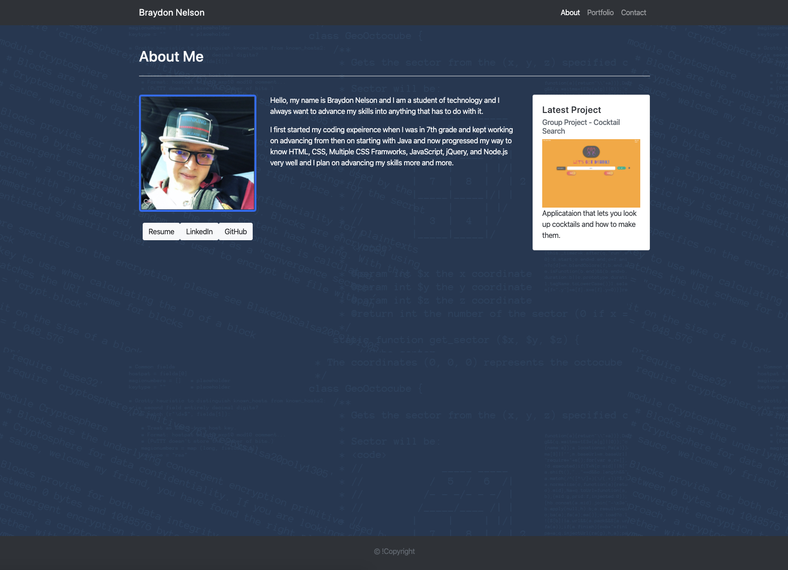
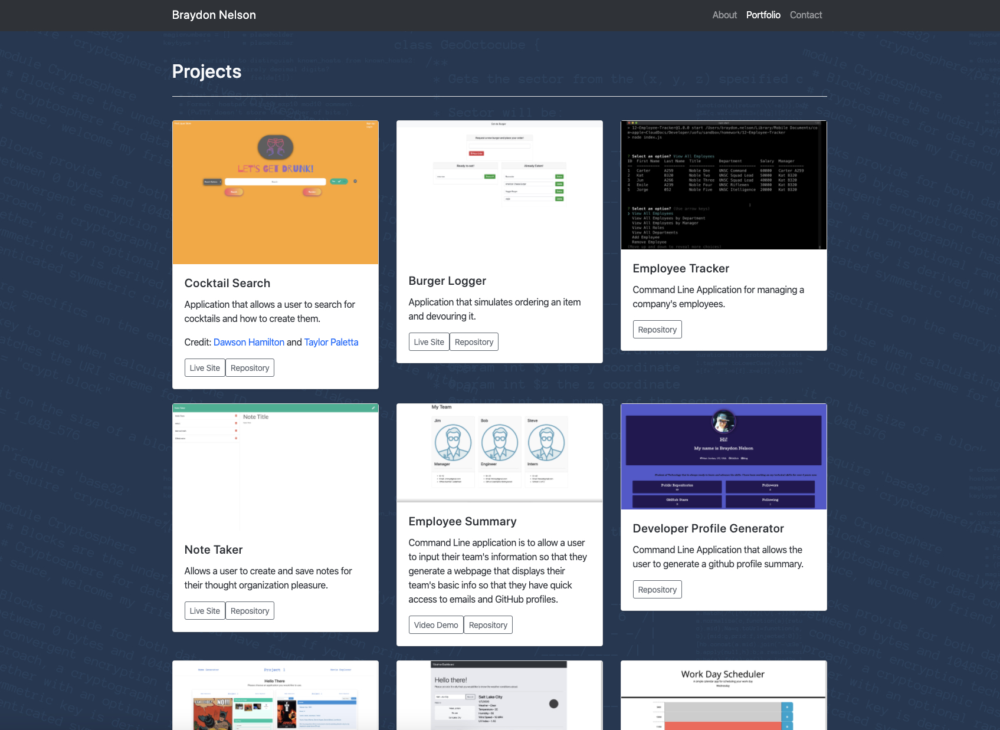
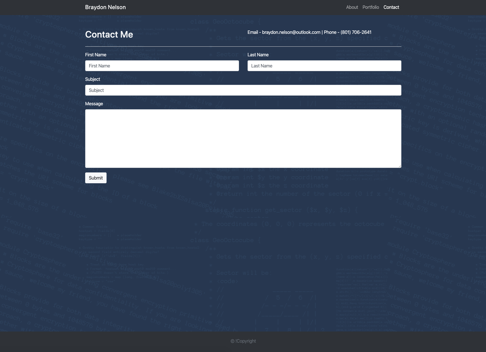

# Portfolio

This is a homework project to make a portfolio using my skills I have learned.

## Authors

* **Braydon Nelson** 

## Photos

### About Me Page

This page would hold a basic info about me and my latest project on the side.

### Portfolio Page

This page contains all of my projects that are public.

### Contact Page

This page contains a form that someone can fillout to get in touch with me.

## Deployed Application Link

https://braydon-nelson.github.io/
